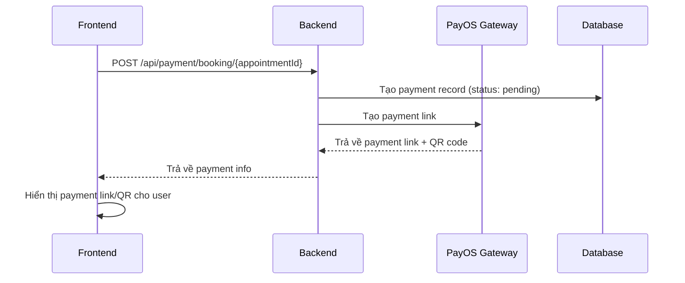
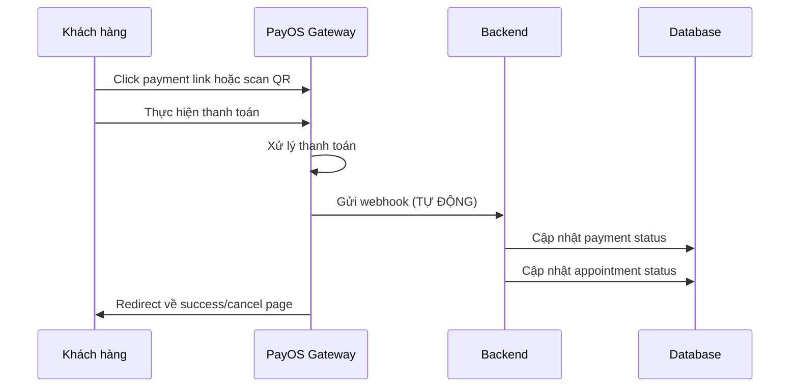

# 💳 Payment Webhook Flow - Frontend Guide

## 📋 Tổng quan

Tài liệu này giải thích luồng thanh toán và webhook PayOS để Frontend team hiểu rõ cách hệ thống xử lý thanh toán.

## 🔄 Luồng thanh toán hoàn chỉnh

### 1. **Khách hàng tạo thanh toán**



### 2. **Khách hàng thanh toán**



## 🎯 Các trạng thái thanh toán

### **Payment Status**

```javascript
const PAYMENT_STATUS = {
  PENDING: "pending", // Chờ thanh toán
  PAID: "paid", // Đã thanh toán
  FAILED: "failed", // Thanh toán thất bại
  CANCELLED: "cancelled", // Đã hủy
  EXPIRED: "expired", // Hết hạn
  REFUNDED: "refunded", // Đã hoàn tiền
};
```

### **Appointment Status**

```javascript
const APPOINTMENT_STATUS = {
  PENDING: "pending", // Chờ xác nhận
  CONFIRMED: "confirmed", // Đã xác nhận (sau khi thanh toán)
  IN_PROGRESS: "in_progress", // Đang xử lý
  COMPLETED: "completed", // Hoàn thành
  CANCELLED: "cancelled", // Đã hủy
};
```

## 🔗 API Endpoints cho Frontend

### 1. **Tạo thanh toán**

```http
POST /api/payment/booking/{appointmentId}
Authorization: Bearer {token}
```

**Response:**

```json
{
  "success": true,
  "message": "Tạo link thanh toán thành công",
  "data": {
    "paymentId": "64f1a2b3c4d5e6f7g8h9i0j1",
    "orderCode": 123456,
    "paymentLink": "https://pay.payos.vn/web/123456",
    "qrCode": "data:image/png;base64,iVBORw0KGgoAAAANSUhEUgAA...",
    "checkoutUrl": "https://pay.payos.vn/web/123456",
    "deepLink": "https://pay.payos.vn/app/123456",
    "amount": 100000,
    "expiresAt": "2024-01-15T10:30:00.000Z"
  }
}
```

### 2. **Kiểm tra trạng thái thanh toán**

```http
GET /api/payment/{paymentId}/status
Authorization: Bearer {token}
```

**Response:**

```json
{
  "success": true,
  "message": "Lấy trạng thái thanh toán thành công",
  "data": {
    "_id": "64f1a2b3c4d5e6f7g8h9i0j1",
    "status": "paid",
    "statusDisplay": "Đã thanh toán",
    "paymentInfo": {
      "amount": 100000,
      "currency": "VND",
      "description": "Thanh toán booking #64f1a2b3c4d5e6f7g8h9i0j1",
      "orderCode": 123456
    },
    "transaction": {
      "transactionId": "TXN_123456789",
      "transactionTime": "2024-01-15T10:25:00.000Z",
      "amount": 100000,
      "fee": 0,
      "netAmount": 100000
    },
    "webhook": {
      "received": true,
      "receivedAt": "2024-01-15T10:25:30.000Z"
    },
    "expiresAt": "2024-01-15T10:30:00.000Z",
    "isExpired": false
  }
}
```

### 3. **Hủy thanh toán**

```http
PUT /api/payment/{orderCode}/cancel
Authorization: Bearer {token}
```

### 4. **Lấy lịch sử thanh toán**

```http
GET /api/payment/my-payments?page=1&limit=10&status=paid
Authorization: Bearer {token}
```

## 🔄 Webhook Flow (Backend tự động xử lý)

### **Khi nào webhook được gửi:**

- ✅ Thanh toán thành công
- ❌ Thanh toán thất bại
- ⏰ Thanh toán hết hạn
- 🚫 Khách hàng hủy thanh toán

### **Webhook URL:**

```
POST https://yourdomain.com/api/payment/webhook
```

### **Webhook Payload (PayOS gửi):**

```json
{
  "orderCode": 123456,
  "status": "PAID",
  "amount": 100000,
  "fee": 0,
  "netAmount": 100000,
  "transactionId": "TXN_123456789",
  "transactionTime": "2024-01-15T10:25:00.000Z",
  "eventId": "evt_123456789"
}
```

### **Backend xử lý webhook:**

1. **Xác thực chữ ký** (bảo mật)
2. **Tìm payment** theo orderCode
3. **Cập nhật trạng thái** payment
4. **Cập nhật trạng thái** appointment
5. **Ghi log** để tracking

## 🎨 Frontend Implementation

### 1. **Tạo thanh toán**

```javascript
const createPayment = async (appointmentId) => {
  try {
    const response = await fetch(`/api/payment/booking/${appointmentId}`, {
      method: "POST",
      headers: {
        Authorization: `Bearer ${token}`,
        "Content-Type": "application/json",
      },
    });

    const data = await response.json();

    if (data.success) {
      // Hiển thị payment link/QR
      showPaymentUI(data.data);
    }
  } catch (error) {
    console.error("Payment creation failed:", error);
  }
};
```

### 2. **Kiểm tra trạng thái thanh toán**

```javascript
const checkPaymentStatus = async (paymentId) => {
  try {
    const response = await fetch(`/api/payment/${paymentId}/status`, {
      headers: {
        Authorization: `Bearer ${token}`,
      },
    });

    const data = await response.json();

    if (data.success) {
      const payment = data.data;

      switch (payment.status) {
        case "paid":
          showSuccessMessage("Thanh toán thành công!");
          updateAppointmentStatus("confirmed");
          break;
        case "cancelled":
          showErrorMessage("Thanh toán đã bị hủy");
          break;
        case "expired":
          showErrorMessage("Thanh toán đã hết hạn");
          break;
        case "failed":
          showErrorMessage("Thanh toán thất bại");
          break;
        default:
          // Vẫn đang pending
          break;
      }
    }
  } catch (error) {
    console.error("Status check failed:", error);
  }
};
```

### 3. **Polling để kiểm tra trạng thái**

```javascript
const pollPaymentStatus = (paymentId, maxAttempts = 30) => {
  let attempts = 0;

  const poll = async () => {
    if (attempts >= maxAttempts) {
      console.log("Polling timeout");
      return;
    }

    const status = await checkPaymentStatus(paymentId);

    if (status === "paid" || status === "cancelled" || status === "expired") {
      // Dừng polling
      return;
    }

    attempts++;
    setTimeout(poll, 2000); // Poll mỗi 2 giây
  };

  poll();
};
```

### 4. **Xử lý redirect từ PayOS**

```javascript
// Trang success: /payment/success?code=00&status=PAID&orderCode=123456
// Trang cancel: /payment/cancel?code=01&status=CANCELLED&orderCode=123456

const handlePaymentRedirect = () => {
  const urlParams = new URLSearchParams(window.location.search);
  const code = urlParams.get("code");
  const status = urlParams.get("status");
  const orderCode = urlParams.get("orderCode");

  if (code === "00" && status === "PAID") {
    // Thanh toán thành công
    showSuccessMessage("Thanh toán thành công!");
    // Redirect về trang appointment hoặc dashboard
    window.location.href = "/appointments";
  } else {
    // Thanh toán thất bại hoặc hủy
    showErrorMessage("Thanh toán không thành công");
    // Redirect về trang booking
    window.location.href = "/booking";
  }
};
```

## 🔍 Debug & Monitoring

### **Kiểm tra webhook hoạt động:**

```javascript
// Test webhook endpoint (chỉ dùng cho development)
const testWebhook = async (orderCode, status = "PAID") => {
  const response = await fetch("/api/payment/test-webhook", {
    method: "POST",
    headers: {
      "Content-Type": "application/json",
    },
    body: JSON.stringify({
      orderCode: orderCode,
      status: status,
      amount: 100000,
    }),
  });

  const data = await response.json();
  console.log("Test webhook result:", data);
};
```

### **Manual sync (khi webhook fail):**

```javascript
const syncPaymentStatus = async (orderCode) => {
  const response = await fetch(`/api/payment/sync/${orderCode}`, {
    method: "POST",
  });

  const data = await response.json();
  console.log("Sync result:", data);
};
```

## ⚠️ Lưu ý quan trọng

### **Cho Frontend:**

1. **Không cần gọi webhook API** - PayOS tự động gửi
2. **Cần polling** để kiểm tra trạng thái thanh toán
3. **Xử lý redirect** từ PayOS success/cancel page
4. **Hiển thị loading state** khi đang chờ thanh toán
5. **Xử lý timeout** khi thanh toán hết hạn

### **Error Handling:**

```javascript
const handlePaymentError = (error) => {
  switch (error.code) {
    case "PAYMENT_NOT_FOUND":
      showErrorMessage("Không tìm thấy thông tin thanh toán");
      break;
    case "PAYMENT_EXPIRED":
      showErrorMessage("Thanh toán đã hết hạn");
      break;
    case "INSUFFICIENT_FUNDS":
      showErrorMessage("Số dư không đủ");
      break;
    default:
      showErrorMessage("Có lỗi xảy ra, vui lòng thử lại");
  }
};
```

## 📱 Mobile App Considerations

### **Deep Link handling:**

```javascript
// Xử lý deep link từ PayOS app
const handleDeepLink = (url) => {
  if (url.includes("pay.payos.vn/app/")) {
    const orderCode = extractOrderCode(url);
    checkPaymentStatus(orderCode);
  }
};
```

### **Push Notifications:**

```javascript
// Nhận thông báo khi thanh toán thành công
const handlePaymentNotification = (notification) => {
  if (notification.type === "payment_success") {
    showSuccessMessage("Thanh toán thành công!");
    refreshAppointmentList();
  }
};
```

## 🎯 Best Practices

1. **Always poll** payment status sau khi tạo payment
2. **Handle all payment states** (pending, paid, cancelled, expired, failed)
3. **Show clear feedback** cho user về trạng thái thanh toán
4. **Implement retry logic** cho API calls
5. **Log payment events** để debug
6. **Handle network errors** gracefully
7. **Validate payment data** trước khi hiển thị

---

## 📞 Support

Nếu có vấn đề với payment flow, liên hệ Backend team với:

- Payment ID
- Order Code
- Error logs
- Screenshots (nếu có)

**Happy coding! 🚀**
